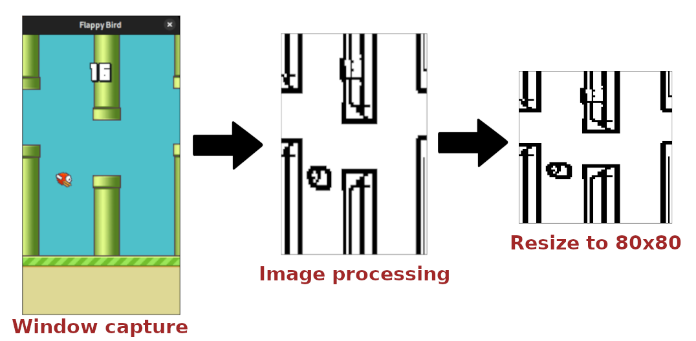

# FlappyBirdAI
AI playing to a Flappy Bird Clone using Reinforcement Learning

This project work with this [Flappy Bird Clone](https://github.com/sourabhv/FlapPyBird). I just made some changes in the code to make the graphics simpler than the original clone game.

## Installation
I'm using python 3.10.6 on Ubuntu 22.04    
I recommend to use a python virtual env, and installing the dependencies by the following commands:
``` bash
sudo apt install pkg-config libcairo2-dev gcc python3-dev libgirepository1.0-dev
pip install -r requirements.txt
```

## Usage
Follow the instructions in training_model.ipynb to train the model.      
Be sure the Flappy Bird game is running, and it's **fully visible** on the screen.      
The program play for you, so don't use your computer while the program is running.

## How it works
### **Image Processing**
Every 0.1 seconds, the program take a screenshot of the game.       
First of all, it crop, convert to grayscale, and process the image to have only important informations.    
Then, it resize the image to 80x80 pixels for the input of model.    
Finally, it convert the image to a numpy array, and normalize it to have values between 0 and 1.    


### **Model**
The model is a convolutional neural network.

Input: 80x80x4 images       
32 relu filters of size 8x8 with stride 4       
max pooling of size 2x2     
64 relu filters of size 4x4 with stride 2       
max pooling of size 2x2     
64 relu filters of size 3x3 with stride 1       
max pooling of size 2x2     
flatten     
ReLU activation     
matrix multiplication       
